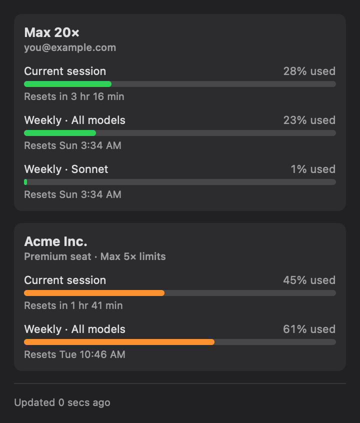
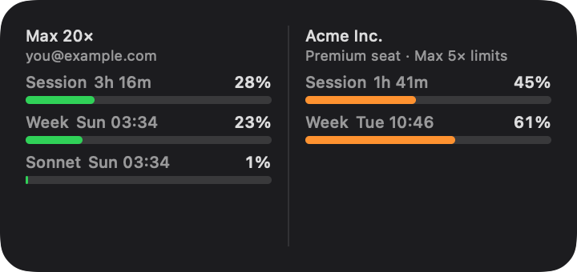

# Claude Pulse

A native macOS **menubar app + widget** that shows your Claude Code usage limits —
the 5-hour session and weekly windows, with reset times — for **every** Claude Code
subscription on your machine at once (e.g. a personal Max account and a Team account).

It reads the same numbers Claude Code's `/usage` and claude.ai's "usage limits" panel
show, and it **never touches the macOS Keychain**, so it never triggers a keychain
password prompt.

- **Menubar:** one ring per subscription with the 5-hour % inside; click for the full
  breakdown.
- **Popover:** per subscription — Current session, Weekly (all models), and Weekly
  Sonnet/Opus when available, each with a progress bar and reset time.
- **Widget:** small (first subscription) or medium (all) for your desktop / Notification
  Center.

## Screenshots

Menubar:


Popover (click the menubar icon) and the medium widget:




> Sample data shown. These images are generated from the app's own views via
> `make screenshots` (renders `UsageSnapshot.sample`), so they never contain real
> account data and regenerate from code — no manual editing.

## Requirements

| Need | Why |
|------|-----|
| macOS 14 (Sonoma) or newer | WidgetKit + `MenuBarExtra` |
| Apple Silicon | Release binaries are arm64-only (Intel: [build from source](#development--build-from-source)) |
| One or more logged-in Claude Code subscriptions | Source of the accounts |

No Apple Developer account, paid membership, or signing certificate is involved — the
app is ad-hoc signed.

## Install

1. Download the latest `ClaudePulse-*.zip` from
   [Releases](https://github.com/psalkowski/claude-pulse/releases/latest) and unzip it.
2. **Move `ClaudePulse.app` to `/Applications`** — required; running it from
   `~/Downloads` would let macOS "translocate" it to a read-only location and break
   auto-updates.
3. First launch only: macOS blocks unsigned downloads. Open **System Settings →
   Privacy & Security**, scroll down, click **Open Anyway** (or run
   `xattr -d com.apple.quarantine /Applications/ClaudePulse.app` and open normally).

That's the last manual install: from then on the app **updates itself** — it checks
GitHub daily, downloads new releases in the background, and relaunches into the new
version silently. The gear menu's **Check for Updates…** triggers a check on demand.

## First-time setup (one token per subscription)

Because Claude Pulse never reads the Keychain, you give it a token explicitly — a
**long-lived (~1 year)** token that Anthropic provides for exactly this purpose:

1. Click the **Claude Pulse** menubar icon. Each subscription shows **Add usage token**.
2. Click it. The window shows the exact command to run, e.g.:
   - Personal: `claude setup-token`
   - Team: `CLAUDE_CONFIG_DIR=~/.claude-team claude setup-token`
3. Run it in a terminal, copy the printed token, paste it in, **Save**.

Tokens are stored in `~/Library/Application Support/ClaudePulse/tokens.json` (mode 0600).
When one stops working (after ~1 year) the card shows "Token rejected" — generate a new
one and paste it via the ⋯ menu → *Replace token*.

### Add the widget

After the first launch, right-click the desktop → **Edit Widgets** → search "Claude
Usage" → add the small or medium size.

## How it works

- **Accounts** are discovered from each logged-in `~/.claude*/.claude.json` (plaintext,
  no Keychain). Subscriptions are listed in a stable order — personal plans first, then
  team — every launch.
- **Labels** (plan tier, org name, seat) are read from those same files.
- **Usage** comes from the `anthropic-ratelimit-unified-*` headers on a tiny 1-token
  `/v1/messages` request — the same data Claude Code uses for its statusline.
- **Polling is activity-gated:** Claude Pulse only makes that request for a subscription
  whose Claude Code was used in the last 10 minutes (it watches `<config-dir>/projects/`
  file times). While you work, the request rides on the already-active session and starts
  nothing; while you're idle it stays quiet and shows the last reading. Turn on **Keep
  sessions active** (gear menu) to poll regardless and deliberately keep a session warm.

## Optional: keep a session warm from a cron job

`scripts/ping-session.sh` sends one 1-token request to start/refresh a 5-hour window for
the token's subscription — handy as a `cron`/Kubernetes `CronJob`:

```sh
CLAUDE_TOKEN='sk-ant-oat...' bash scripts/ping-session.sh
```

Use the default model (Haiku) — Sonnet is burst-throttled for these pings and isn't a
reliable trigger.

## Settings (gear menu)

- **Show in Menu Bar** — pick which subscriptions appear in the menubar.
- **Keep sessions active** — poll every subscription regardless of activity.
- **Launch at Login**.
- **Check for Updates…** — manual update check (updates also run automatically).

## Development — build from source

| Need | Why | Auto-installed? |
|------|-----|-----------------|
| **Xcode** (full app, from the App Store) | Builds the app + widget extension | no (App Store) |
| **XcodeGen** | Generates the Xcode project from `project.yml` | yes, via Homebrew |
| `jq` | Only for the optional `scripts/` helpers | optional |

```sh
git clone <this-repo> claude-pulse && cd claude-pulse
./install.sh
```

`install.sh` checks for Xcode, installs XcodeGen via Homebrew if missing, builds, copies
the app to `/Applications`, and launches it. Versions are stamped from git (latest tag +
commit count), so a source build behind the newest release will auto-update to the
release binary, while a build ahead of it is left alone.

Releases are cut by pushing a tag: `git tag v0.X.Y && git push origin v0.X.Y` — GitHub
Actions builds, signs (Sparkle EdDSA), and publishes the zip + appcast.

## Notes

- Ad-hoc signed — macOS warns once on first launch of a downloaded copy (see Install);
  Sparkle-installed updates never re-trigger Gatekeeper.
- The request mimics Claude Code (`User-Agent: claude-cli/...`, `anthropic-beta:
  oauth-2025-04-20`) — required, or the endpoint rate-limits aggressively.
- See [SPEC.md](SPEC.md) for the full design and rationale.
